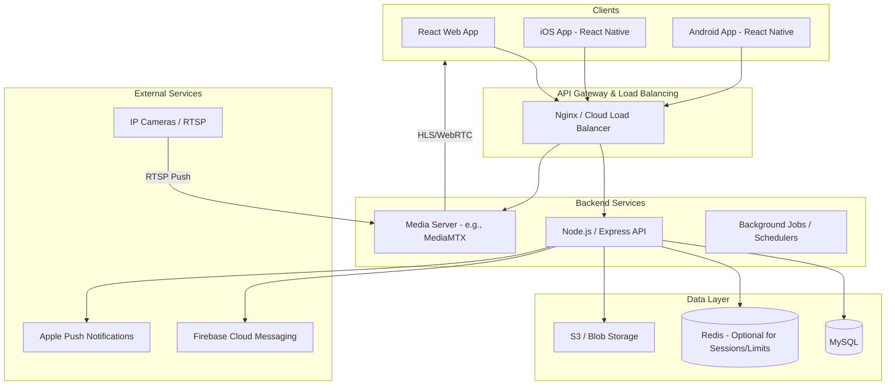
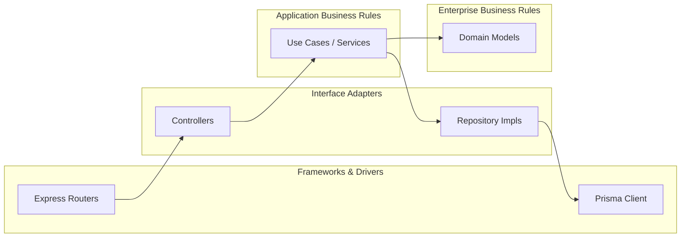

# System Architecture

The platform follows a layered, client-server architecture with dedicated media processing for cameras.

## High-Level Architecture

## Backend Clean Architecture

We separate concerns into layers to keep business logic independent of external services.

