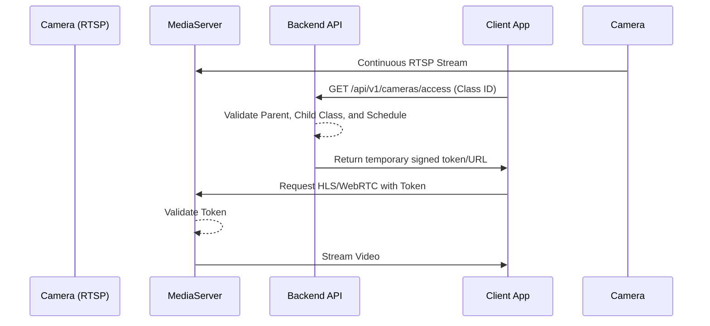

# Camera & Media Architecture

Camera integration is a critical feature requiring high security and privacy.

## Architecture

## 1. Media Server
We deploy a specialized media server (e.g., MediaMTX, Kurento, or SRS) that ingests RTSP streams from the physical IP cameras in the nursery and transcodes/repackages them to HLS and WebRTC.

## 2. Security & Access
- The media server must authenticate viewer requests.
- The Node.js backend acts as the gatekeeper. When a parent wants to view a camera, they request a ticket/token from the API.
- The API checks business rules: Is it the right time? Is the child checked in?
- The backend signs a short-lived JWT that the client passes to the media server.

## 3. Bandwidth
- HLS will be the primary delivery method as it scales cheaply across CDNs if required.
- Stream quality is locked at 720p or lower to reduce bandwidth on both the nursery's uplink and the server out.
